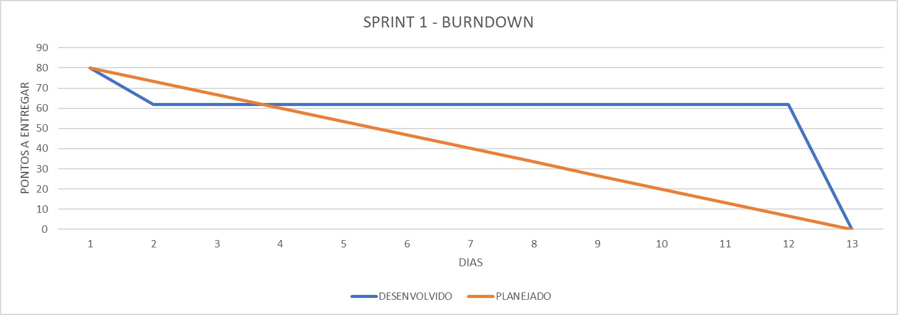

|     Prioridade               |    Tarefa          |  Status          | Planning Poker |
|------------------------------|--------------------|------------------|:----------------:|
|      🔴 Alta                      |  Layout                  |    💚 Concluido             | 8️⃣ |
|      🔴 Alta                    |     Protótipos das telas no Figma               | 💚 Concluido   |  5️⃣|
|      🔴  Alta                     |     Modelo E-R               | 💚 Concluido                    | 8️⃣ |
|      🟡  Media                      |   HTML (uso adequado da linguagem)                 |  💚 Concluido                  | 1️⃣3️⃣ |
|      🟡  Media                      |   CSS (uso adequado das propriedades CSS com classes, identificadores etc.)                 |   💚 Concluido   | 1️⃣3️⃣|
|      🔵 Baixa                      |    Menu com links                |   💚 Concluido                 | 2️⃣  |
|      🔵 Baixa                      |     Cores e contrastes               |     💚 Concluido                | 5️⃣  | 
|      🟢 outras                      |    GitHub: descrição do projeto, link para cada entrega de sprint, prints das tela ou link para o portal, tecnologias utilizadas e membros da equipe (com link para o GitHub de cada membro)  |   💚 Concluido  | 3️⃣|
|      🟢 outras                     |   GitHub: User stories com Ator, ação e motivo                 |       💚 Concluido            |  3️⃣ | 
|      🟢 outras                      |   GitHub: backlog do produto e sprint priorizado (baixa, média e alta prioridade)                 |   💚 Concluido                | 3️⃣ |
|      🟢 outras                      |   Trello: cronograma de tarefas com link para o GitHub                 |    💚 Concluido               | 3️⃣ |

Sprint Review:

Nessa primiera Sprint o grupo se sentiu muito perdido e desorganizado, tanto que foi necessario a intervenção do professor para podermos realizar uma grande mudança organizacional, essa falta de desorganização impactou em nossa produditivada e desenvolvimento, visto que pouco nessa primeira sprint foi desenvolvida. Para a proxima o grupo pretende se reorganizar a fim de melhor seu desempenho e produtividade.
